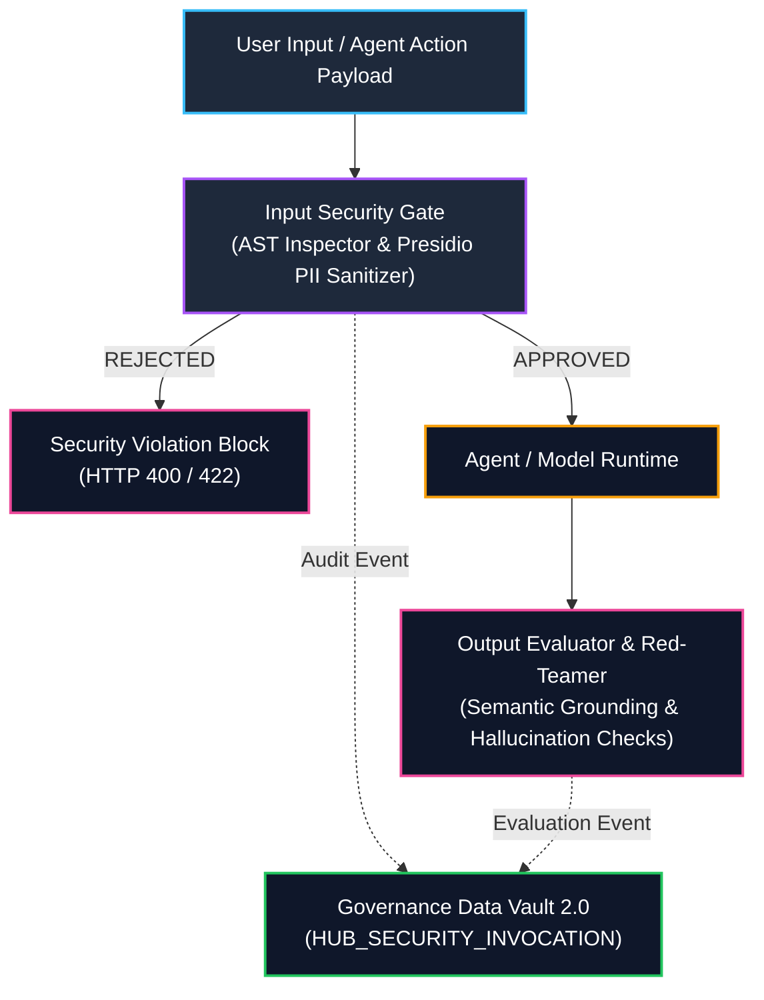

# Adversarial AI Agent Guardrail & Validation Engine

An enterprise-grade, real-time AI security, PII anonymization, and model validation pipeline backed by an immutable **Data Vault 2.0 Governance Audit Ledger**.

---

## 🏗️ Architecture Overview



## 🔑 Key Features & System Modules
### 1. Real-Time Input Security Gate (`guardrails/`)
- **AST & Pattern Threat Inspector (ast_inspector.py):** Intercepts prompt injection vectors, system overrides, jailbreak payloads, and unauthorized code execution commands (`eval`, `exec`, `drop table`).

- **Presidio PII Anonymizer (pii_sanitizer.py):** Automatically detects and masks sensitive personal data (`EMAIL_ADDRESS`, `PHONE_NUMBER`, `CREDIT_CARD`, `US_SSN`) in context payloads prior to model invocation.

### 2. Output Grounding & Hallucination Evaluator (`guardrails/output_evaluator.py`)
- **Semantic Grounding Verification:** Evaluates generated model responses against input context payloads to ensure factual bounds and calculate hallucination risk indices.

- **Adversarial Red-Teaming Suite (`tests/test_adversarial_suite.py`):** Automated test suites evaluating agent resilience against known adversarial jailbreak patterns using pytest and deepeval.

### 3. Enterprise Data Vault 2.0 Governance Ledger (`data_vault/`)
- **Deterministic Hashing:** Computes standard SHA-256 hash keys (`HK_INVOCATION_ID`) according to Data Vault 2.0 standards for immutable auditability.

- **Audit Tables (schema.sql):** Maintains an append-only ledger tracking all model invocations, prompt threat evaluations, and PII anonymization outputs (`HUB_SECURITY_INVOCATION`, `SAT_INPUT_GUARDRAIL`, `SAT_PII_SANITIZATION`).

### 4. Interactive Security Dashboard (app.py)
- Built with Streamlit to provide live visual verification of prompt safety verdicts, sanitized context outputs, and structured Data Vault audit records.

## 📁 Repository Layout

```Plaintext
agent-guardrail-validation-engine/
├── config/                  # Engine & Database Configurations
├── data_vault/              # Data Vault 2.0 DDLs & Hash Audit Logger
│   ├── audit_logger.py
│   └── schema.sql
├── engine/                  # Core FastAPI Orchestration Engine
│   └── orchestrator.py
├── guardrails/              # Real-Time Security & Evaluation Modules
│   ├── ast_inspector.py
│   ├── output_evaluator.py
│   └── pii_sanitizer.py
├── tests/                   # Unit, Integration & Adversarial Test Suites
│   ├── test_adversarial_suite.py
│   ├── test_audit_logger.py
│   └── test_guardrails.py
├── .gitignore
├── app.py                   # Streamlit Security Dashboard UI
├── main.py                  # FastAPI Service Entry Point
├── requirements.txt
└── README.md
```

## 🚀 Quickstart Guide
### 1. Environment Setup (Conda in WSL Ubuntu)

```Bash
# Clone the repository
git clone [https://github.com/vrrgithub1/agent-guardrail-validation-engine.git](https://github.com/vrrgithub1/agent-guardrail-validation-engine.git)
cd agent-guardrail-validation-engine

# Activate Conda environment
conda create -n agent-guardrail python=3.10 -y
conda activate agent-guardrail

# Install core dependencies & Spacy NLP model
pip install -r requirements.txt
python -m spacy download en_core_web_sm
```

### 2. Run Test Suite (PyTest)

```Bash
pytest tests/
```

### 3. Launch FastAPI Gateway

```Bash
uvicorn main:app --reload --host 0.0.0.0 --port 8000
```

Access interactive OpenAPI documentation at `http://127.0.0.1:8000/docs` .

### 4. Launch Streamlit Dashboard

```Bash
streamlit run app.py
```

Access the interactive dashboard UI at `http://localhost:8501` .


